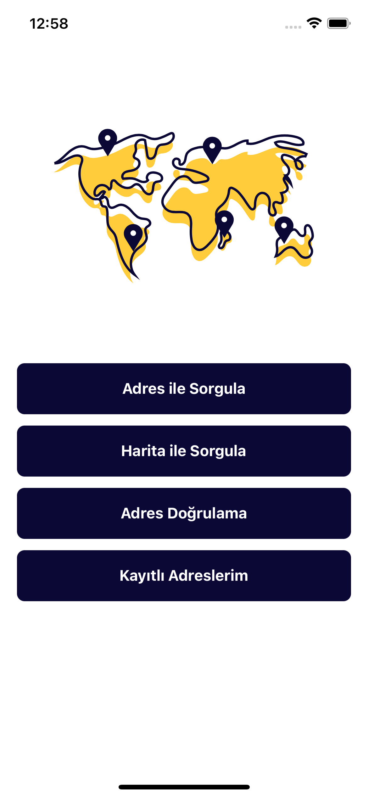
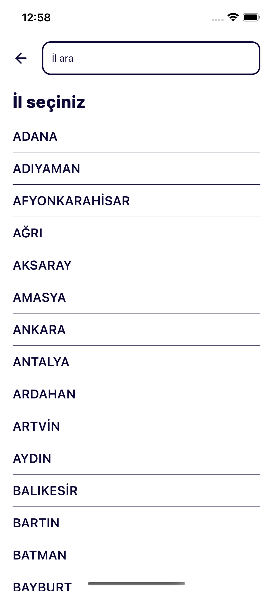
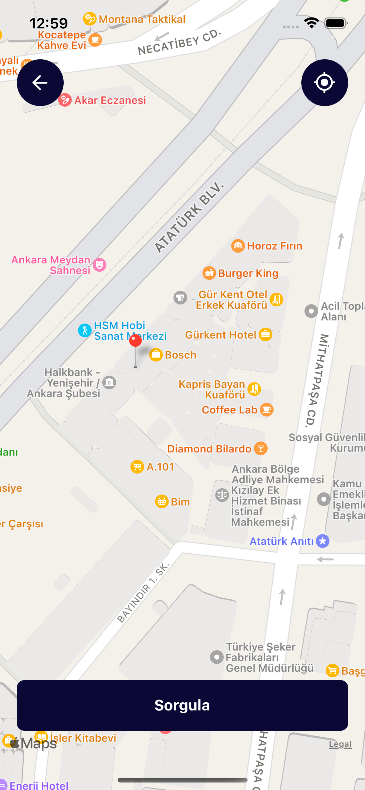
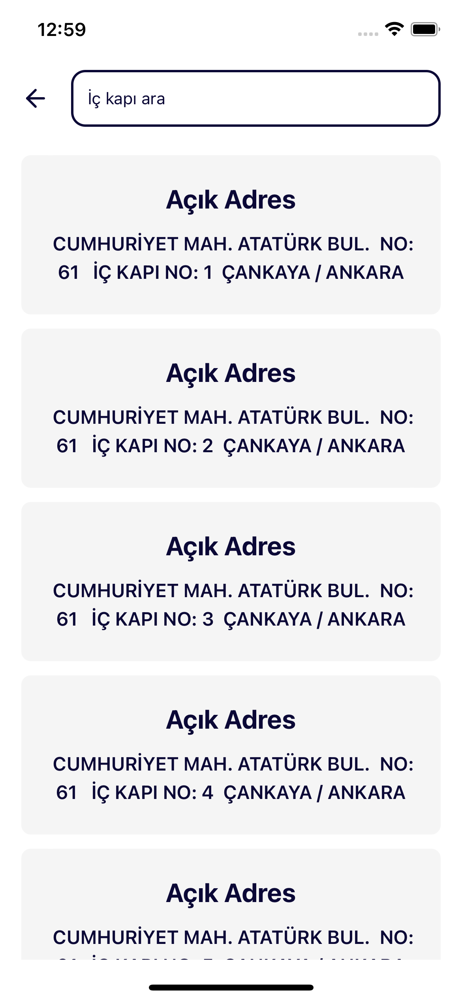
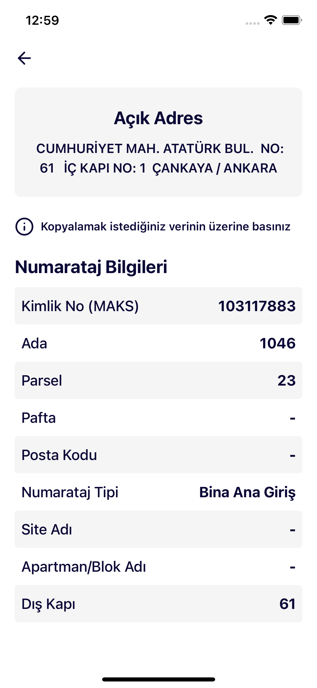
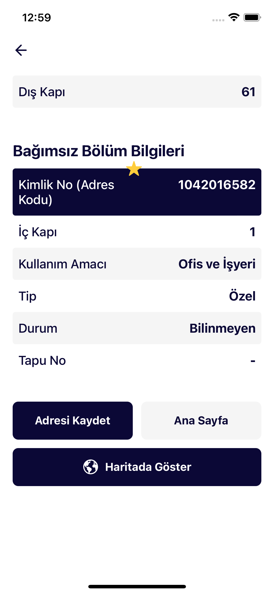
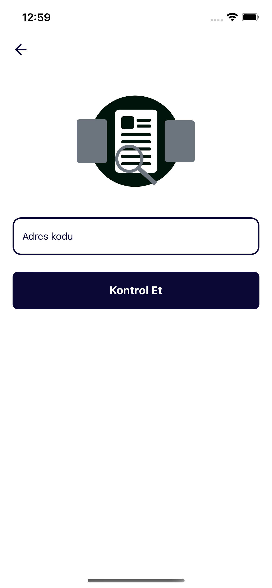

# Liddl - Adres Kodu

### Stack: React Native

### React Native öğrenirken geliştirdiğim 2. uygulama. (android)

### Google Play Store

#### https://play.google.com/store/apps/details?id=com.liddlapp.adreskodu

## Screenshot

